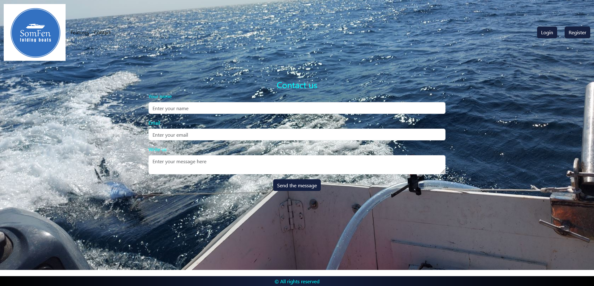

# FOLDING BOATS
## Intro
This is a Spring Boot Java project.
I've designed and created three types of folding boats with a lot of passion. 
Currently, they are stored in my garage and I need to find out your opinion about them.

## Domain model
* User
* Role
* Boat
* Picture
* Opinion
* Comment

FoldingBoats is a website where all visitors are able to share their opinions about my boats. 

<h2>Project Screenshots:</h2>

<h2>🧐 Features</h2>

Here are some of the project's best features:

*   Collection of different opinions and comments: Even non-registered users are able to share their impressions via email by using the website Contact page.

*   Website's administrator is able to add a new model of boat and share its characteristics with users.

*   Users roles management - the administrator is able to change the role of users.

<h2>💻 Built with</h2>

Technologies used in the project:

*   Java
*   Spring Boot
*   Spring Security
*   Spring Data JPA
*   MySQL
*   Thymeleaf and Thymeleaf with Springsecurity6
*   HTML CSS JavaScript
*   Bootstrap
*   Cloudinary for managing images
*   Spring Boot Mail for sending and receiving emails

<h2>🛡️ License:</h2>

This project is licensed under the MIT License.

<h2>💖Like my work?</h2>

If you have any questions suggestions or issues with FoldingBoats please feel free to contact me at my email address: htaushanov@yahoo.com. I'd be happy to hear from you! 😊

